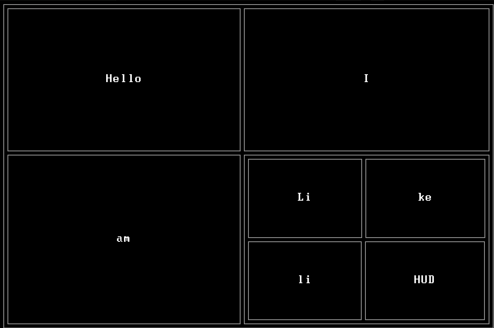

# A simple UI library written in Lua for the LÖVE2D framework

[](https://github.com/LRDPRDX/LikeliHUD/actions/workflows/doc.yml)
[](https://github.com/LRDPRDX/LikeliHUD/actions/workflows/pages/pages-build-deployment)

:warning: It's raw, not tested, not polished. There are gaps to be filled :warning:

## Give it a taste

```lua
local ui = require('ui')

local simple = ui.Layout {
    rows    = 2,
    columns = 2,

    ui.Label { text = 'Hello', },

    ui.Label { text = 'I', },

    ui.Label { text = 'am', },

    ui.Layout {
        rows    = 2,
        columns = 2,

        ui.Label { text = 'Li', },

        ui.Label { text = 'ke', },

        ui.Label { text = 'li', },

        ui.Label { text = 'HUD', },
    }
}

for block in simple:traverse() do
    block.border = true
end
```



## Feature list

- Basic elements are :
    - `Layout`
    - `Stack`
    - `Image`
    - `Label`
- Declarative approach. Similar to QML.
- Grid layout. Nested layouts are possible.
- Auto alignment. Alignment hints : `center`, `top`, `bottom`, `left` or a combination.
- Each element inside a layout can be set to fill `width`, `height`, both or
  none.
- Communication with the external logic through the signals "attached" to the
  elements

## Examples

Run `main.lua` :

```bash
love path/to/likelihud
```

and press `1`, `2`, `3` to switch between examples. See the code [here](/examples).

### Layout

This is a demo (code [here](/main.lua)):


### Signals

This is the simplest game ever written with LÖVE2D (code [here](/examples/o.lua)):


### Documentation

Documentation is available [here](https://lrdprdx.github.io/LikeliHUD/).

## Acknowledgements and similar projects

I had seen several ui libs before I decided to write my own. Though I didn't
find the one which would have everything I needed I've learned a lot from them.

- More or less the list of those can be found
here [love2d ui libs](https://www.love2d.org/wiki/Graphical_User_Interface).
- Also see [yui](https://codeberg.org/1414codeforge/yui)

